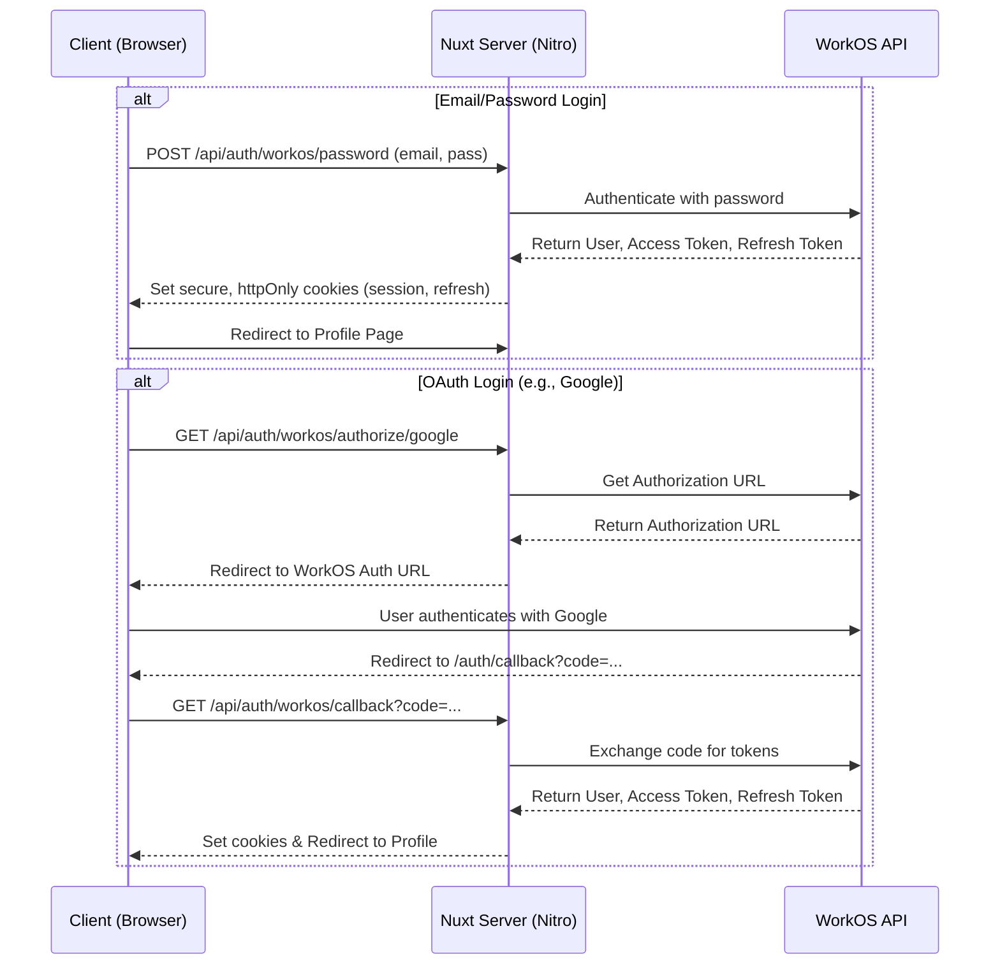

# Architecture Overview

This project is a Nuxt 3 application designed with a modular and scalable architecture, leveraging the full potential of its file-based routing and auto-import features.

## Core Technologies

- **Framework**: Nuxt 3
- **Language**: TypeScript
- **UI Styling**: UnoCSS
- **Authentication Provider**: WorkOS
- **Linting & Formatting**: BiomeJS
- **Testing**: Vitest
- **Schema Validation**: Zod

## Directory Structure & Conventions

The project follows the standard Nuxt 3 directory structure, with specific conventions to enhance maintainability:

- **`app/`**: The core of the frontend application.
  - **`components/`**: Reusable Vue components, organized by feature/domain (e.g., `auth/`, `profile/`, `settings/`, `ui/`).
  - **`composables/`**: Reusable business logic and state management, broken down into fine-grained, single-responsibility functions (e.g., `useUserState`, `useAuthActions`, `useProfilePage`).
  - **`pages/`**: Application routes. Kept lean by delegating logic to composables and UI to components.
  - **`layouts/`**: Defines the main layouts for different sections of the app (e.g., `default`, `account`).
  - **`middleware/`**: Handles route protection (e.g., `auth.ts`, `guest.ts`).
- **`server/`**: The Nitro backend.
  - **`api/`**: API endpoints, primarily acting as a proxy to the WorkOS service.
  - **`utils/`**: Server-side helper functions, abstracting away direct WorkOS SDK calls (e.g., `auth.ts`, `user.ts`, `api.ts`).
- **`shared/`**: Isomorphic code shared between the client and server.
  - **`types/`**: Centralized TypeScript type definitions and Zod schemas for runtime data validation.

## Authentication Workflow

